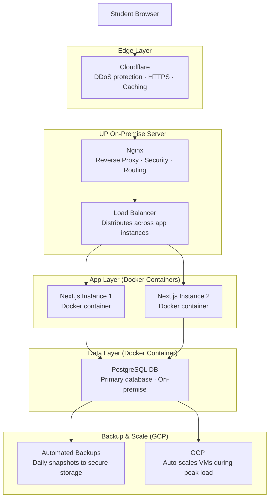

# CMSC126_Activity_Unit5_Unit6

```mermaid
flowchart TD
    Student[Student Browser]
    Student --> CF

    subgraph Edge["Edge Layer"]
        CF[Cloudflare\nDDoS protection · HTTPS · Caching]
    end

    subgraph UP["UP On-Premise Server"]
        Nginx[Nginx\nReverse Proxy · Security · Routing]
        LB[Load Balancer\nDistributes across app instances]
        Nginx --> LB
    end

    subgraph AppLayer["App Layer (Docker Containers)"]
        N1[Next.js Instance 1\nDocker container]
        N2[Next.js Instance 2\nDocker container]
    end

    subgraph DataLayer["Data Layer (Docker Container)"]
        PG[PostgreSQL DB\nPrimary database · On-premise]
    end

    subgraph Backup["Backup & Scale (GCP)"]
        AB[Automated Backups\nDaily snapshots to secure storage]
        GCP[GCP \nAuto-scales VMs during peak load]
    end

    CF --> Nginx
    LB --> N1
    LB --> N2
    N1 --> PG
    N2 --> PG
    PG --> AB
    PG --> GCP
```
## Mock-ups

1. **Homepage**
   
3. **Student Dashboard**
   
5. **View Schedule**
   - **Tabular View**
      
   - **List View**
      
6. **Grades**
   
