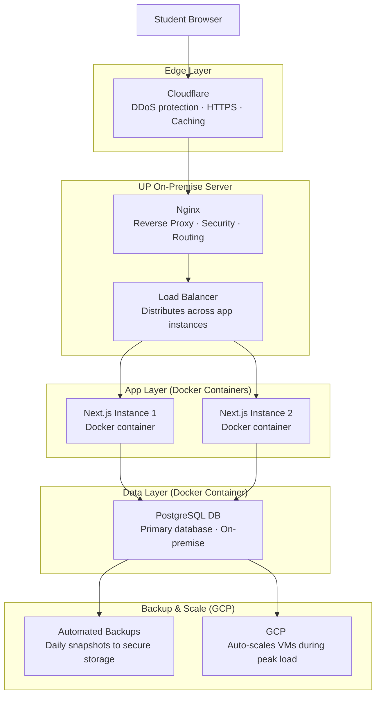

# CMSC126_Activity_Unit5_Unit6
## System Overview

The UPV Computerized Registration System (CRS) 2.0 is a university-scale platform designed for students, faculty, and administrators. It facilitates key academic processes such as registration, enrollment, schedule management, and academic records management across the entire University of the Philippines Visayas.

This proposed system aims to provide an improved and more efficient version of the current UPV CRS platform by addressing its existing usability and design limitations. The redesigned CRS 2.0 resolves several issues found in the original interface, enhancing both usability and visual appeal. The updated design adopts a cleaner and more modern layout to reduce visual clutter and improve user experience.

- Features are organized more effectively through the use of a sidebar and hotbar, along with dropdown menus and tab-based navigation to streamline access to different functions.
- Text readability has also been improved by increasing font sizes, while the login feature has been emphasized and simplified for easier access.
- Additionally, a search bar has been integrated to allow users to quickly locate specific features or information.
- The homepage prioritizes the announcements section, which now includes a carousel feature that enables users to easily browse through updates.

**Team Members:**  
Ryona Cassandra Honrado, Erine Lourdes Medalla, Percie Louise Samaniego, Gianna Angela Severino, Adrienne Nicole Tipon

---

## Tech Stack

### a. Frontend Tools

React is an open-source JavaScript library developed by Meta for building user interfaces. It breaks the page into reusable components like a grade table, an enrollment form, and a subject list, each of which updates on its own without reloading the entire page. During pre-enlistment, a student needs to see slot counts change in real time and get immediate feedback when a class fills up. React handles that without restarting the page.

### b. Backend Tools

Next.js is a React framework developed by Vercel that adds backend capabilities to React. This means the same codebase that renders the CRS interface can also handle processes like verifying a student’s login and checking slot availability during online registration. It ensures that when a student enrolls in a subject or updates their information, the system validates and records it correctly in real time. It also builds pages on the server before sending them to the browser, so when many students access the portal at once for pre-enlistment, the system remains responsive during peak usage.

### c. Databases

PostgreSQL is an open-source relational database management system that stores data in structured tables with defined relationships between them. It is ACID-compliant, meaning every transaction is either completed fully or not at all. When two students claim the last slot in a class at the same moment, this makes sure that only one transaction is completed. 

### d. Other Tools

GitHub - for code review and team collaboration
Canva/Figma - for wireframe and mockup design

## Hosting and Deployment
Since most hosting solutions rely on third-party infrastructure outside the University of the Philippines’ direct control, student data stored on platforms such as Render’s PostgreSQL servers resides on external systems. While this setup may be suitable for development or prototyping, a full deployment of the UPV Computerized Registration System (CRS) 2.0 would require UP Visayas to implement and manage its own server infrastructure. This ensures greater control over data security, privacy, and compliance with institutional and data protection standards.

### UP Visayas On-Premise Servers + GCP (Google Cloud Platform)

A hybrid infrastructure combining UP Visayas’ on-premise servers and Google Cloud Platform (GCP) is proposed to balance data sovereignty and system scalability. Sensitive student data, including personal and academic records, will be hosted on university-managed on-premise servers under the supervision of the UP ICT office to ensure compliance with institutional data governance and privacy policies. Core services such as the PostgreSQL database may be deployed locally within secure Dockerized environments, ensuring consistent runtime behavior and isolation. This is in accordance to the Data Privacy Act of 2012 (RA 10173).

The application should run on physical servers managed by UP's ICT office on-campus. Each part of the system, the Next.js app, the PostgreSQL database is packaged in Docker containers, which bundle the app with everything it needs to run so it behaves consistently across any server.

Incoming requests are routed through Nginx, which acts as the front door of the server, directing traffic to the correct container and handling load balancing across multiple running instances of the app.

## How It Works

- Requests pass through Nginx on UP Servers, which handles routing, basic security, and load balancing
- Next.js runs Docker containers on UP servers, allowing consistent deployment and scalability during high traffic
- PostgreSQL database remains under UP control on-premises or private instance which will be accessed securely from GCP services via private networking
- The use of Cloud support is for:
  - Backups and disaster recovery
  - System monitoring and logging
  - Optional load support during peak demand
- For the deployment, updates are managed via GitHub and deployed to GCP services, ensuring fast and consistent releases

## Mock-ups

1. **Homepage**
   
   
3. **Student Dashboard**
   
   
5. **View Schedule**
   - **Tabular View**
      .png)
     
   - **List View**
      .png)
     
6. **Grades**
   
